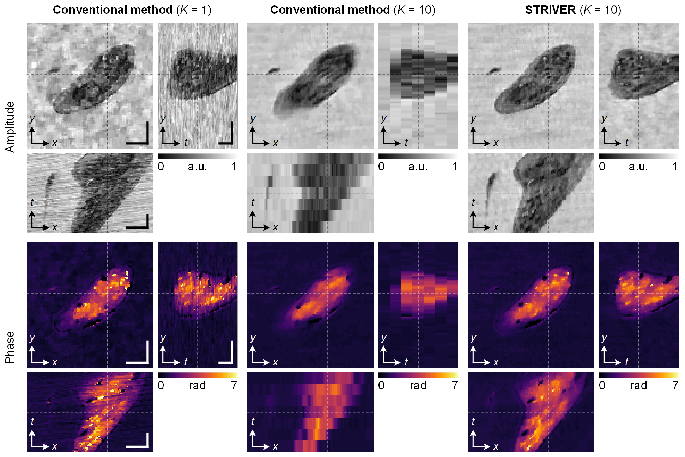
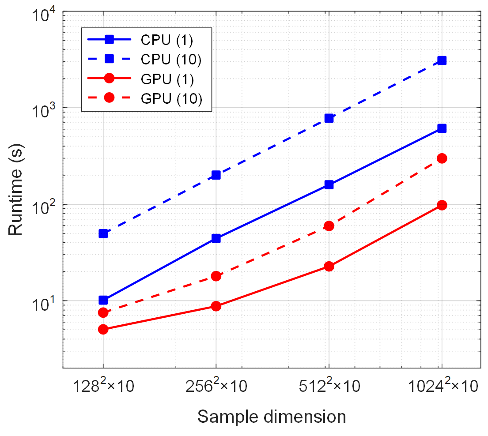

# STRIVER: SpatioTemporally Regularized InVERsion for motion-resolved computational imaging

Authors: **[Yunhui Gao](https://github.com/Yunhui-Gao)** (gyh21@mails.tsinghua.edu.cn) and **[Liangcai Cao](http://faculty.dpi.tsinghua.edu.cn/clc.html)** (clc@tsinghua.edu.cn)

*[HoloLab](http://www.holoddd.com/), Tsinghua University*

_______

 <strong>Figure 1</strong>. Comparison of different holographic reconstruction methods in imaging a swimming paramecium.

Holography is a powerful technique that records the amplitude and phase of an optical field simultaneously, enabling a variety of applications such as label-free biomedical analysis and coherent diffraction imaging. Holographic recording without a reference wave has been long pursued because it obviates the high experimental requirements of conventional interferometric methods. However, due to the ill-posed nature of the underlying phase retrieval problem, reference-free holographic imaging is faced with an inherent tradeoff between imaging fidelity and temporal resolution. Here, we propose a general computational framework, termed **spatiotemporally regularized inversion (STRIVER)**, to achieve motion-resolved, reference-free holographic imaging with high fidelity. Specifically, STRIVER leverages signal priors in the spatiotemporal domain to jointly eliminate phase ambiguities and motion artifacts, and, when combined with diversity measurement schemes, produces a physically reliable, time-resolved holographic video from a series of intensity-only measurements. We experimentally demonstrate STRIVER in near-field ptychography, where dynamic holographic imaging of freely swimming paramecia is performed at a framerate-limited speed of 112 fps. The proposed method can be potentially extended to other measurement schemes, spectral regimes, and computational imaging modalities, pushing the temporal resolution toward higher limits.

 <strong>Figure 2</strong>. Holographic videos of live paramecia.

## Requirements
The code has been implemented using Matlab 2022b. Older visions may be sufficient but have not been tested.

## Quick Start
- **Phase retrieval using simulated data.** Run [`demo_sim.m`](https://github.com/THUHoloLab/STRIVER/blob/master/main/demo_sim.m) with default parameters.

## Accelerated Implementations
The basic demo codes provide intuitive and proof-of-concept implementations for beginners, but are far from efficient. To facilitate faster reconstruction, we provide an optimized version based on CPU or GPU, which can be found at [`demo_sim_fast.m`](https://github.com/THUHoloLab/STRIVER/blob/master/main/demo_sim_fast.m). To enable GPU usage, simply set `gpu = true;` in the code.

Table 1 and Figure 3 show the runtime (200 iterations) for different video dimensions. The results are obtained using a laptop computer with Intel&reg; Core&trade; i7-12700H (2.30 GHz) CPU and Nvidia GeForce RTX&trade; 3060 GPU.

|  Video dimension  | CPU (1) | GPU (1) | CPU (10) | GPU (10) |
|  :----:                          | :----: | :----: | :----:      | :----:      |
|  128  $\times$ 128  $\times$ 10  | 10.15 s | 5.05 s  |  49.63 s     | 7.53 s       |
|  256  $\times$ 256  $\times$ 10  | 44.27 s | 8.78 s  |  200.67 s    | 17.98 s      |
|  512  $\times$ 512  $\times$ 10  | 159.19 s | 22.71 s |  779.55 s    | 59.57 s      |
|  1024 $\times$ 1024 $\times$ 10  | 611.11 s | 97.81 s |  3093.24 s   | 299.10 s     |

 <strong>Table 1</strong>. Runtimes (for 200 iterations) using GPU and CPU for different sample dimensions. The number in the parenthesis denotes the subiteration number for the proximal update.

 <strong>Figure 3</strong>. Runtimes (200 iterations) using CPU and GPU for different sample dimensions. The number in the parenthesis denotes the subiteration number for the proximal update.

## Theories and References
For algorithm derivation and implementation details, please refer to our paper:

[Yunhui Gao and Liangcai Cao, "Motion-resolved, reference-free holographic imaging via spatiotemporally regularized inversion," *Optica* **11**(1), XXXX-XXXX (2024).](https://doi.org/10.1364/OPTICA.506572)